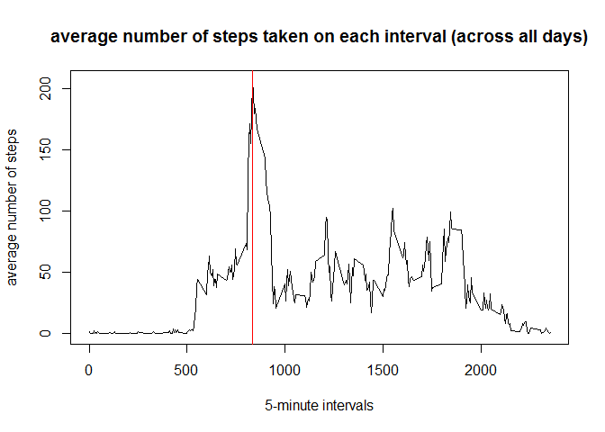

# Reproducible Research: Peer Assessment 1

## Loading and preprocessing the data

To start the analysis of the data, let's load it from the "activity.csv" file into a data frame called "data"


```r
data <- read.csv("activity.csv")
```

In first place, I will use only the valid values so let's store them in a data frame called "clean_data"

```r
clean_data <- data[complete.cases(data),]
```

In order to manipulate the data it is necessary to load some libraries:

```r
library(dplyr)
library(lubridate)
```

Then before starting the analysis, let's save some subsets of the main data to make our work easier

First let's create a subset of the "clean_data" data frame, that is grouped by date and for each day stores the total amount of steps taken in that day.

```r
total_steps_by_day <- clean_data %>% mutate(date=as.numeric(date)) %>% group_by(date) %>% summarize(steps=sum(steps)) 
```

Finally, let's create another subset of the "clean_data" data frame, that is grouped by interval, and for each interval stores the mean of the steps taken on that interval across all the days.

```r
mean_steps_by_interval <- clean_data %>% group_by(interval) %>% summarize(m_steps=mean(steps))
```

## What is the mean and median total number of steps taken per day?
The mean of the total steps per day is

```r
daily_mean <- mean(total_steps_by_day$steps)
print(daily_mean)
```

```
## [1] 10766.19
```

The median of the total steps per day is

```r
daily_median <- median(total_steps_by_day$steps)
print(daily_median)
```

```
## [1] 10765
```

In the following figure, we can observe a histogram of the total number of steps taken by day, as well as the mean (red line) and median (blue line). (The median and mean are very close in their value so the lines are a little bit difficult to see as they are overlapping):

```r
#total_steps_by_day_numeric <- total_steps_by_day %>% mutate(date=as.numeric(date))
plot(total_steps_by_day, type="h", xlim=c(0,max(total_steps_by_day$date)), ylab="amount of days", xlab="steps taken", main="total number of steps taken by day")
abline(h=daily_mean, col="red", lwd=2)
abline(h=daily_median, col="blue", lwd=1)
```

 


## What is the average daily activity pattern?
In order to analyze the daily activity pattern, let's use the dataset we just create that for each interval stores the mean of the steps taken on that interval across all the days.

First let's find the interval with the maximum number of average steps and print it:

```r
max_steps_inteval <- mean_steps_by_interval[mean_steps_by_interval$m_steps==max(mean_steps_by_interval$m_steps),"interval"][[1]]
print(max_steps_inteval)
```

```
## [1] 835
```

Now let's plot all the average amount of steps per interval as a time series graph, with a line reporting the interval with maximum number of average steps (red line).

```r
plot(mean_steps_by_interval, type="l", main="average number of steps taken on each interval (across all days)", ylab="average number of steps", xlab="5-minute intervals", xlim=range(mean_steps_by_interval$interval))
abline(v=max_steps_inteval, col="red", lwd=1)
```

 


## Imputing missing values
Total amount of missing values in the original data is:

```r
sum(is.na(data$steps))
```

```
## [1] 2304
```

In order to fill the missing values, let's use on each missing value the average amount of step for that interval of the day

```r
merged_data <- merge(data,mean_steps_by_interval,all=TRUE,by="interval")
data[is.na(data$steps),"steps"] <- merged_data[is.na(data$steps),"m_steps"]
```

Now let's check if there is any missing values left:

```r
sum(is.na(data$steps))
```

```
## [1] 0
```

There is no more missing values in the data, now let's calculate again the subsets of the data frame with the missing vluaes replaced by the average of steps for each interval:


```r
total_steps_by_day <- data %>% mutate(date=as.numeric(date)) %>% group_by(date) %>% summarize(steps=sum(steps)) 
mean_steps_by_interval <- data %>% group_by(interval) %>% summarize(m_steps=mean(steps))
```


Using the data filled with the average number of steps for each interval when a value was missing let's see the mean, median, and the histogram again:

The mean of the total steps per day is

```r
daily_mean <- mean(total_steps_by_day$steps)
print(daily_mean)
```

```
## [1] 10889.8
```

The median of the total steps per day is

```r
daily_median <- median(total_steps_by_day$steps)
print(daily_median)
```

```
## [1] 11015
```

Histogram of the total number of steps taken by day, as well as the mean (red line) and median (blue line):

```r
plot(total_steps_by_day, type="h", xlim=c(0,max(total_steps_by_day$date)), ylab="amount of days", xlab="steps taken", main="total number of steps taken by day")
abline(h=daily_mean, col="red", lwd=1)
abline(h=daily_median, col="blue", lwd=1)
```

 

## Are there differences in activity patterns between weekdays and weekends?

Let's add a new colum called "day" with the factor variable that describes if a date is a weekday day or a weekend day:


```r
data <- data %>% mutate(day=(wday(date, lab=TRUE)=="Sun"|wday(date, lab=TRUE)=="Sat")) %>% mutate(day=factor(day,labels=c("weekday", "weekend")))
```

To analyze the data by the type of day, let's create a subset of the weekend days and the weekday days of the data:

```r
weekday_steps_by_interval <- data %>% group_by(interval) %>% filter(day=="weekday") %>% summarize(m_steps=mean(steps))

weekend_steps_by_interval <- data %>% group_by(interval) %>% filter(day=="weekend") %>% summarize(m_steps=mean(steps))
```

Now let's make a panel plot containing a time series plot of the intervals and average numbers, averaged across weekday days or weekend days. 


```r
par(mfrow=c(2,1))

plot(weekday_steps_by_interval, type="l", main="average steps per intervals on weekdays", xlab="5-minute interval", ylab="average of steps", xlim=range(weekday_steps_by_interval$interval))

plot(weekend_steps_by_interval, type="l", main="average steps per intervals on weekends", xlab="5-minute interval", ylab="average of steps", xlim=range(weekend_steps_by_interval$interval))
```

 
